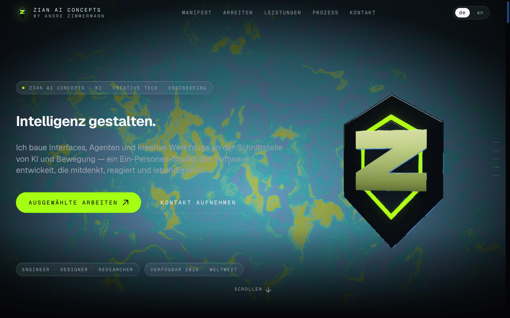

# ZIAN AI CONCEPTS — Landing Page

Animated single-page landing for **ZIAN AI CONCEPTS** (André Zimmermann). Tech-noir design, scroll-triggered timeline choreography, bilingual DE/EN.



## Stack

- **Vite 7** + **React 19** + **TypeScript** (strict, with `noUncheckedIndexedAccess`)
- **Tailwind CSS v4** (CSS-first `@theme` config)
- **GSAP 3** + **ScrollTrigger** + `@gsap/react` (pinned scrubbed timelines, horizontal pin scroll)
- **Three.js** via **@react-three/fiber** (liquid-gradient shader in hero, lazy-loaded)
- **Lenis** (smooth scroll bridged into ScrollTrigger)
- **react-i18next** (DE default, EN toggle, persisted in localStorage)
- **lucide-react** icons, **Geist** + **Geist Mono** via `@fontsource-variable`
- **Playwright** e2e tests

## Quick start

```bash
npm install
cp .env.example .env   # form endpoint, ollama URL, analytics — all optional
npm run dev                     # http://localhost:5173
```

## Scripts

| Script | What it does |
|---|---|
| `npm run dev` | Start Vite dev server |
| `npm run build` | Type-check (`tsc -b`) and build to `dist/` |
| `npm run preview` | Preview production build |
| `npm run typecheck` | Run TypeScript only |
| `npm run test:e2e` | Run Playwright suite (set `PLAYWRIGHT_PORT` to override the default 5180) |
| `npm run test:e2e:ui` | Playwright UI runner |
| `npm run test:e2e:headed` | Playwright headed mode |
| `npm run test:e2e:report` | Open the last HTML report |

## Environment variables

| Variable | Purpose |
|---|---|
| `VITE_FORM_ENDPOINT` | POST URL for the contact form. Unset → form runs in demo mode (700ms fake delay, console.info payload). |
| `VITE_SITE_URL` | Public origin used for canonical URLs, OG, sitemap. Default `https://zian-ai.dev`. |
| `VITE_OLLAMA_ENDPOINT` | Ollama base URL (e.g. `http://localhost:11434` for the local Docker stack, or `https://ollama.example.com`). Unset → AI demo plays from mocked replies with Ollama branding. |
| `VITE_OLLAMA_MODEL` | Model name (default `qwen2.5:3b`). |
| `VITE_ANALYTICS_SCRIPT_URL` | Privacy-friendly analytics snippet (Plausible/Umami). Triggers the cookie banner; loaded only after consent. |
| `VITE_ANALYTICS_SITE_ID` | Site/website id forwarded as `data-website-id`. |
| `VITE_ANALYTICS_DOMAIN` | Domain attribute forwarded as `data-domain`. |

## Local AI demo via Docker

The Connect section's AI chat streams from an Ollama `/api/chat` endpoint. Without
`VITE_OLLAMA_ENDPOINT` it runs in mock mode (canned replies). To run a real model
locally, use the bundled `docker-compose.yml`:

```bash
docker compose up -d                  # starts Ollama + pulls qwen2.5:3b
docker compose logs -f model-init     # wait until the pull finishes & the container exits
```

Then point the app at it:

```bash
echo 'VITE_OLLAMA_ENDPOINT=http://localhost:11434' >> .env
npm run dev                           # the mode badge should now read "Powered by Ollama · qwen2.5:3b"
```

Sanity-check the API directly:

```bash
curl http://localhost:11434/api/tags  # qwen2.5:3b is listed
```

Tear down with `docker compose down` (keeps the model) or `docker compose down -v`
(also drops the `ollama` volume, ~2GB). The browser calls Ollama directly, so the
compose file sets `OLLAMA_ORIGINS` to allow the dev/preview/Playwright origins — add
yours there if you change ports.

> **macOS note:** Docker can't pass through the Metal GPU, so this runs CPU-only and
> is slower than the native [Ollama.app](https://ollama.com), which serves the same
> `http://localhost:11434` endpoint if you prefer the speed.

## What to customize after install

1. **Logo** — replace `public/logo.svg` (square viewBox recommended).
2. **OG image** — drop a real `public/og-image.png` (current `og-image.svg` is a stand-in; meta tags point to the PNG).
3. **Case-study thumbnails** — `public/work/*.{jpg,png}` referenced from `src/components/sections/SelectedWork.tsx`.
4. **Copy** — all text lives in `src/locales/de.json` and `src/locales/en.json`.
5. **Imprint / Privacy** — fill in `imprint.body` / `privacy.body` strings (rendered by the pages under `src/pages/`).
6. **Form endpoint** — set `VITE_FORM_ENDPOINT` once your Formspree / Web3Forms project exists.
7. **AI Demo** — either set `VITE_OLLAMA_ENDPOINT` or keep mock mode. Edit suggestions and mocked replies in `locales/{de,en}.json → aiDemo`.
8. **Social URLs** — `SOCIALS` constant at the top of `src/components/sections/Connect.tsx`.
9. **Analytics** — set `VITE_ANALYTICS_*` env vars to enable cookie banner + snippet loading.
10. **SEO** — `VITE_SITE_URL` controls canonical URLs and the `public/sitemap.xml` / `public/robots.txt` entries.

## File map

```
src/
├── main.tsx                  # entry + i18n init + BrowserRouter
├── App.tsx                   # Routes + Lenis lifecycle + Loader gating
├── lib/
│   ├── i18n.ts               # react-i18next setup
│   ├── lang.ts               # Lang type + isLang/resolveLang helpers
│   ├── gsap.ts               # GSAP plugin registration
│   ├── smoothScroll.ts       # Lenis ↔ ScrollTrigger bridge
│   ├── scrollToSection.ts    # shared anchor-scroll util (Lenis-aware)
│   ├── animations.ts         # splitText / splitWords / revealWordsOnScroll / horizontalScroll / marquee
│   ├── useMagnet.ts          # magnetic hover hook
│   ├── consent.ts            # localStorage-backed consent state + event bus
│   ├── analytics.ts          # consent-gated analytics snippet loader
│   └── chatBackend.ts        # Ollama-streaming or mock-throwing chat client
├── locales/{de,en}.json      # translation resources
├── styles/globals.css        # Tailwind v4 @theme + cursor + utilities
├── components/
│   ├── Layout.tsx
│   ├── Header.tsx            # sticky nav + IO-driven active section
│   ├── LangToggle.tsx
│   ├── Footer.tsx
│   ├── Cursor.tsx            # dot + trailing ring, desktop only
│   ├── PageTransition.tsx    # fade between routes (keyed by pathname)
│   ├── Loader.tsx            # GSAP intro (skipped under reduced motion)
│   ├── CookieBanner.tsx      # only renders when analytics is configured
│   ├── Seo.tsx               # per-route title / OG / hreflang / JSON-LD
│   ├── webgl/
│   │   ├── LiquidGradientMesh.tsx     # R3F canvas + postprocessing
│   │   ├── StaticGradientFallback.tsx
│   │   ├── WebGLErrorBoundary.tsx
│   │   └── liquidGradientShader.ts
│   └── sections/
│       ├── Hero.tsx          # intro timeline + liquid WebGL backdrop
│       ├── Manifesto.tsx     # staggered reveal lines
│       ├── SelectedWork.tsx  # horizontal pin-scroll cases
│       ├── Capabilities.tsx  # sticky-header service list + mini index
│       ├── Process.tsx       # sticky-header process steps
│       ├── Marquee.tsx       # endless velocity-boosted tool ribbon
│       └── Connect.tsx       # AI chat terminal + inline contact form
└── pages/
    ├── Home.tsx · Impressum.tsx · Datenschutz.tsx
```

## Accessibility & Performance

- `prefers-reduced-motion`: Lenis, hero intro and scroll-driven reveals bypass; WebGL falls back to a static conic gradient.
- Scroll-driven animations restrict themselves to `transform` / `opacity` and clean up in their effect cleanup.
- Custom cursor hidden on `pointer: coarse` and reduced-motion devices.
- Three.js, postprocessing and GSAP are split into manual chunks and `LiquidGradientMesh` is `lazy`-loaded.
- Form fields use `aria-invalid` / `aria-describedby` and a honeypot field; the inline form lives inside the chat log for a single conversational flow.
- Cookie banner only mounts when analytics is actually configured; consent is event-bus driven.
- Header mobile menu is `inert` when closed and closes on `Esc` / route change.
